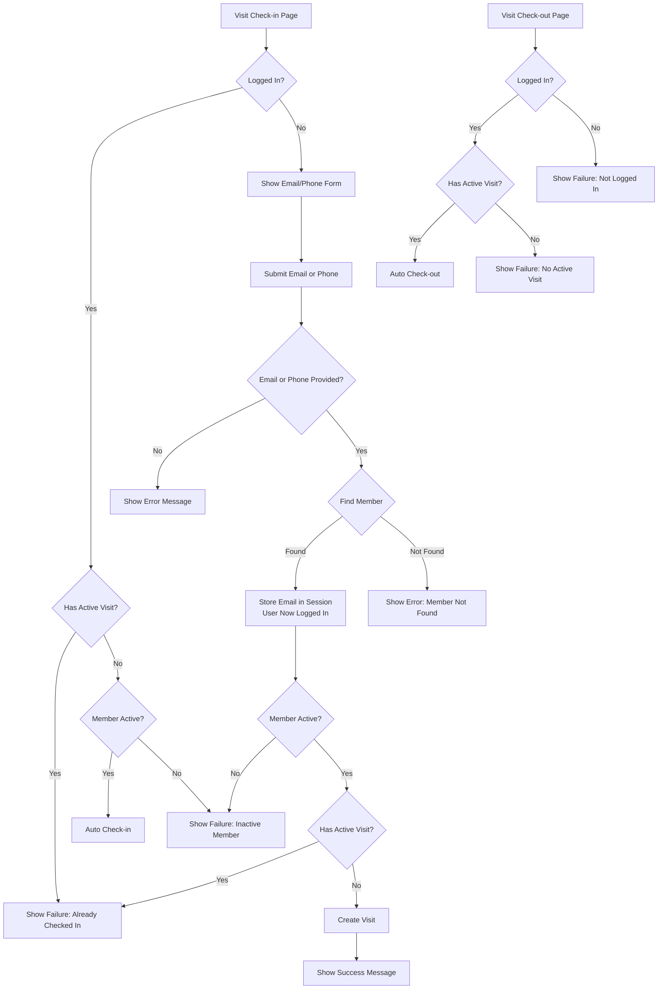

# Mulai Gym Web App

It's a Django project, for Gym Management System. The Gym name is called Mulai Gym. It's in Bandung, Indonesia. It's a gym focused for Newbies.
https://www.instagram.com/mulaigym.id
https://mulaigym.id

## Infrastructure & Deployment

### DNS & SSL Setup
- **Domain**: mulaigym.id (registered with Niagahoster/Hostinger)
- **DNS**: Cloudflare nameservers (`bruce.ns.cloudflare.com`, `janet.ns.cloudflare.com`)
- **SSL**: Let's Encrypt certificates via Cloudflare DNS challenge
- **Server**: DigitalOcean Droplet (178.128.116.170)
- **Proxy**: Cloudflare (proxied A record)

### SSL Certificate Management
- **Provider**: Let's Encrypt (90-day certificates)
- **Method**: Cloudflare DNS challenge (supports wildcards)
- **Auto-renewal**: Cron job runs daily at 3 AM
- **Domains**: `mulaigym.id` and `*.mulaigym.id`

## Visits & Check-in/Out

### Session
- 1-year duration
- Key: `member_email` (Used even when logging in/checking in via phone number)
- Persists across check-in/out

### Models
- **`Visit` (`visits/models.py`)**
  - `member`: ForeignKey (Member)
  - `check_in_time`: DateTimeField
  - `check_out_time`: DateTimeField (nullable)
- **`Member` (`accounts/models.py`)**
  - `phone_number`: CharField (Unique, stores digits only, e.g., 628123...)
  - `active_until`: DateTimeField (nullable)
  - `is_active_member` property: Checks if `active_until >= today`.

### Admin (`visits/admin_init.py`)
- **`MemberAdmin`**
  - Displays name, email, phone, `active_until`, status.
  - `membership_status` method calculates Active/Expired.
- **`VisitAdmin` (`visits/admin.py`)**
  - Displays member, check-in/out times, duration.
  - Filters, search fields defined.

### Views (`visits/views.py`)
- **`check_in_page`**
  1. Checks session for `member_email`.
  2. If logged in:
     - Tries auto check-in (validates active member, no active visit).
     - Renders success/failure template.
  3. If not logged in or auto-check-in fails:
     - Shows email OR phone number form (`check_in.html`).
     - On POST:
       - If email provided, finds `Member` by email.
       - If phone provided, formats phone (handles country code, strips leading zeros) and finds `Member` by `phone_number`.
       - If neither provided, shows error.
       - If `Member` found:
         - **Logs user in:** Stores `member.email` in session (`member_email`) immediately.
         - Validates active member status -> renders failure if inactive.
         - Validates no active visit -> renders failure if already checked in.
         - Creates `Visit`, renders success (`quick_check_in.html`).
       - If `Member` not found, shows error.
- **`check_out_page`**
  1. Checks session for `member_email` (renders fail if not logged in).
  2. Tries auto check-out:
     - Finds latest active `Visit` for member.
     - Sets `check_out_time`, saves `Visit`.
     - Renders success/failure template.
- **`forget_member`**
  - Clears `member_email` from session.

### Check-in/Out Flow Diagram

### Validations & Messages
- Check-in:
  - Must provide Email or Phone Number.
  - Member must exist.
  - Must be active member (logged in even if check-in fails here).
  - No duplicate active visits (logged in even if check-in fails here).
  - Messages: "Already Checked In", "Membership Expired", "Member not found", "Please provide email or phone".
- Check-out:
  - Must be logged in
  - Must have active visit
  - Messages: "Not Logged In", "No Active Visit Found"

## Accounts

### Forms (`accounts/forms.py`)
- **`MemberSignUpForm`, `MemberEditForm`**: Include `country_code` (default +62) and `phone_number_display` fields. The `clean` method standardizes the phone number (e.g., removes +, strips leading 0) and stores it in the `phone_number` model field (digits only). Performs uniqueness validation.
- **`MemberLoginForm`**: Includes `email` (optional), `country_code` (optional), and `phone_number_display` (optional). Requires either email or phone to be provided. Formats phone number if provided.

### Views (`accounts/views.py`)
- **`member_login`**: Accepts POST data from `MemberLoginForm`. 
  - Validates that either email or phone was provided.
  - If email provided, finds `Member` by email.
  - If phone provided (and no email), finds `Member` by formatted `phone_number`.
  - On success, stores `member.email` in session (`member_email`) and redirects to details.
  - On failure (not found, invalid form), shows error message.
- **`MemberSignUpView`**: After successful signup, stores `member.email` in session (`member_email`) for auto-login.

### Templates
- `login.html`: Updated to include email and phone number fields (with country code).
- `check_in.html`: Updated to include email and phone number fields (with country code).
- `signup.html`, `member_edit.html`: Include country code and phone number fields.

## Payments

### Model (`Payment`)
- `payment_method`: CharField (TRANSFER, QRIS, CASH), default TRANSFER, blank=True.
- `created_by`: ForeignKey (User), SET_NULL, null=True, blank=True. Automatically set in admin.
- `membership_end_date`: Calculated in `save()`, not editable in forms.

### Admin (`visits/admin_init.py`)
- **`CustomPaymentAdmin`**
  - Uses `PaymentAdminForm`.
  - `fieldsets` exclude `created_by`.
  - `save_model` sets `created_by = request.user`.
  - `payment_method` shown as dropdown.

### Membership Duration Logic (`Payment.save()`)
1.  **Determine Start Date**:
    - If member active (`active_until >= today`): `start_date = member.active_until + 1 day`.
    - If member inactive (`active_until < today` or `None`): `start_date = payment_date` (or today).
2.  **Calculate Payment `membership_end_date`**:
    - Based on `start_date + duration` (using `relativedelta`).
3.  **Update Member `active_until`**:
    - Always set `member.active_until = self.membership_end_date`.
    - Ensures correct stacking/renewal regardless of current status.

## Tamu (Guest Book)

### Model (`accounts/models.py`)
- **`Tamu`**: For guests who are visiting but not working out.
  - `name`: CharField (Guest's name)
  - `phone_number`: CharField (Contact number)
  - `has_worked_out_before`: CharField (Guest's previous gym experience)
  - `social_media_username`: CharField (Optional social media handle)

### Admin (`accounts/admin.py`)
- **`TamuAdmin`**:
  - Displays guest details in the admin panel.
  - Includes a clickable `whatsapp_link` for easy contact.

### Views (`accounts/views.py`)
- **`tamu_signup_view`**:
  - Renders a simple form for guests to fill out.
  - On submission, saves the data and shows a success page.

---

## Products & Sales

### Models (`payments/models.py`)
- **`Package` (Product)**: Represents a membership or service package.
  - `code`: CharField (Unique code for the package, e.g., "M1")
  - `default_price`: DecimalField (The standard price of the package)
  - `description`: CharField (A brief description of the package)
- **`Payment` (Sale)**: Represents a transaction for a package.
  - `member`: ForeignKey (The member who made the purchase)
  - `package`: ForeignKey (The package that was purchased)
  - `amount`: DecimalField (The amount paid)
  - `payment_date`: DateTimeField (When the payment was made)
  - `created_by`: ForeignKey (The admin who recorded the payment)

### Admin (`visits/admin_init.py` & `payments/admin.py`)
- **`PackageAdmin`**:
  - Allows for managing product packages directly from the admin panel.
- **`PaymentAdmin`**:
  - Displays a detailed list of all sales transactions.
  - Automatically assigns the logged-in admin to the `created_by` field on new entries.

### Membership Logic (`Payment.save()`)
- When a `Payment` is saved, it intelligently calculates the member's new `active_until` date.
- If the member is already active, the new membership duration is stacked on top of their existing one.
- If the member is inactive, the new membership starts from the payment date.

---

## Masukkan (Feedback)

### Model (`accounts/models.py`)
- **`Masukkan`**: To collect feedback, critiques, and suggestions.
  - `name`: CharField (Optional)
  - `contact`: CharField (Optional contact info)
  - `feedback`: TextField (The feedback content)

### Admin (`accounts/admin.py`)
- **`MasukkanAdmin`**:
  - Displays all submitted feedback.
  - Provides a link to the details, even for anonymous submissions.

---

## Troubleshooting

### SSL Certificate Issues
- **Error 526**: Usually means expired certificate or DNS configuration mismatch
- **Check certificate status**: `sudo certbot certificates`
- **Manual renewal**: `sudo certbot renew --force-renewal`
- **Test auto-renewal**: `sudo certbot renew --dry-run`

### Common Commands
- **Restart services**: `sudo systemctl reload nginx && docker restart mulai_web`
- **Check logs**: `docker logs mulai_web`
- **Nginx test**: `sudo nginx -t`
