# Mulai Gym Web App

It's a Django project, for Gym Management System. The Gym name is called Mulai Gym. It's in Bandung, Indonesia. It's a gym focused for Newbies. Our goal is to be the best gym for newbie in Bandung, so when anyone in Bandung wants to start the habit of going to the gym, they will choose us.
https://www.instagram.com/mulaigym.id
https://mulaigym.id

The main plus point of my gym is "gym paling nyaman & paling cocok untuk pemula, & paling ramah sesama member suasananya"
Few key taglines: "Karena Hidup Sehatmu Mulai Dari Sini", "Gym terbaik untuk Pemula", "Gym Paling Nyaman di Bandung"

Insights:
- Around 80% of the members are still newbies, Mulai Gym being their first ever gym. Which is really good, truly according to my expectation, my initial goal why I wanted to build this gym: To make as many people to start working out in a Gym regurlarly.
- Around 50% of them takes classes, either Kelas Pemula (Silver) or Semi Private (Gold).
- I have 2 fulltime employees as admin (which includes front office, gym keeper, chat admin, and content creation, so can imagine split task) and 1 part time for same role. 1 full time personal trainer that teach classes, 1 part time trainer. EVERYONE is working EXTREMELY happily.
- The employees-to-members relation are so good, I feel, so many members feel like second home at gym, they give food to each other, play outside gym, basically a literal small local community now. once a new member actually joins like a class, the others kindly approach them so they  feel comfortable, so nice. of course some people still prefer to be "leave me alone I just want to work out", but that's not the majority.
- The business profitability isn't that well, churn rate still not that good, some people leave unfortunately due to moving job, city, house, etc., but they still befriends.
- The marketing & sales side isn't that optimal as well I think, somehow.
- Created quite a lot of short videos already in instagram, youtube, tiktok, but low engagement, low reach, etc. Basically, we don't have a dedicated content strategy yet, nobody knows how to do it properly yet.

Mulai Gym was opened since June 28, 2025.

> This file documents **what the system does**: per-feature behaviour, business rules, admin workflows, infra. How to work in the codebase (stack, commands, conventions, testing, gotchas) lives in `CLAUDE.md`.

# Overall Architecture
Infrastructure & Deployment Architecture


Django application architecture

```mermaid
graph TB
    subgraph Internet
        Users[👥 Users/Members<br/>Web Browsers]
    end
    
    subgraph "Cloudflare"
        CF[☁️ Cloudflare<br/>DNS + Proxy + SSL]
    end
    
    subgraph "Hostinger"
        DNS[🌐 Domain Registration<br/>mulaigym.id]
    end
    
    subgraph "DigitalOcean Droplet<br/>178.128.116.170"
        NGINX[🔀 Nginx<br/>Reverse Proxy]
        Docker[🐳 Docker Container]
        
        subgraph "mulai_web Container"
            Django[⚙️ Django App<br/>Gunicorn]
            Static[📦 Static Files<br/>WhiteNoise]
        end
        
        Cron[⏰ Cron Jobs<br/>- Class Generation<br/>- Reminder Generation<br/>- SSL Renewal]
    end
    
    subgraph "Supabase"
        DB[(🗄️ PostgreSQL<br/>Database)]
    end
    
    Users -->|HTTPS| CF
    CF -->|Proxied| NGINX
    DNS -.->|Nameservers| CF
    NGINX --> Docker
    Docker --> Django
    Django -->|TCP Connection| DB
    Cron -.->|Daily Tasks| Django
    
    style CF fill:#f9a825
    style Docker fill:#0db7ed
    style DB fill:#3ecf8e
    style Django fill:#092e20
```


Simplified Entity Relationship Diagram
```mermaid
erDiagram
    Member ||--o{ Visit : "checks in"
    Member ||--o{ Payment : "makes"
    Member ||--o{ Sale : "purchases"
    Member ||--o{ Reminder : "receives"
    Member ||--o{ ClassBooking : "books"
    
    Payment }o--|| Package : "uses"
    
    Sale ||--|{ SaleItem : "contains"
    SaleItem }o--|| Product : "references"
    
    ClassInstance ||--o{ ClassBooking : "has"
    ClassSchedule ||--o{ ClassInstance : "generates"
    Class ||--o{ ClassSchedule : "has"
    
    User ||--o{ Payment : "creates"
    User ||--o{ Sale : "records"
    
    Member {
        int id PK
        string name
        string email UK
        string phone_number UK
        string gender
        int age
        datetime active_until
        datetime pemula_active_until
        datetime semi_private_active_until
        boolean is_pemula
        boolean asked_referral
        boolean asked_google_review
        boolean missed_installment
        boolean skip_auto_reminder
    }
    
    Visit {
        int id PK
        int member_id FK
        datetime check_in_time
        datetime check_out_time
    }
    
    Payment {
        int id PK
        int member_id FK
        int package_id FK
        decimal amount
        datetime payment_date
        datetime membership_end_date
        string payment_method
        boolean apakah_nyicil
        int created_by FK
    }
    
    Package {
        int id PK
        string code UK
        decimal default_price
        string description
    }
    
    Sale {
        int id PK
        int member_id FK
        decimal total_amount
        string payment_method
        datetime created_at
        int created_by FK
    }
    
    SaleItem {
        int id PK
        int sale_id FK
        int product_id FK
        int quantity
        decimal price_at_purchase
    }
    
    Product {
        int id PK
        string name UK
        decimal price
        boolean is_active
    }
    
    Reminder {
        int id PK
        int member_id FK
        string reminder_type
        string reason
        date due_date
        boolean is_resolved
        datetime resolved_date
    }
    
    ClassInstance {
        int id PK
        int class_schedule_id FK
        date date
        time start_time
        time end_time
        string status
    }
    
    ClassSchedule {
        int id PK
        int class_id FK
        int day_of_week
        time start_time
        time end_time
    }
    
    Class {
        int id PK
        string name
        text description
        int max_members
    }
    
    Equipment {
        int id PK
        string name UK
        string slug UK
        text description
        string video_link
        json additional_videos
        string muscle_group
        int total_views
    }
    
    User {
        int id PK
        string username UK
        string user_type
        boolean is_staff
    }
    
    ClassBooking {
        int id PK
        int member_id FK
        int class_instance_id FK
        string status
    }
```

## Infrastructure & Deployment

### DNS & SSL Setup
- **Domain**: mulaigym.id (registered with Niagahoster/Hostinger)
- **DNS**: Cloudflare nameservers (`bruce.ns.cloudflare.com`, `janet.ns.cloudflare.com`)
- **SSL**: Let's Encrypt certificates via Cloudflare DNS challenge
- **Server**: DigitalOcean Droplet (178.128.116.170)
- **Proxy**: Cloudflare (proxied A record)

### SSL Certificate Management
- **Provider**: Let's Encrypt (90-day certificates)
- **Method**: Cloudflare DNS challenge (supports wildcards)
- **Auto-renewal**: Cron job runs daily at 3 AM
- **Domains**: `mulaigym.id` and `*.mulaigym.id`

## Homepage

Section order: hero → Ramadan (when on) → Kenapa Mulai → **Ulasan** → Mari Mulai → Fasilitas → kontak footer. The proof lands right after the reasons to join and directly before the Mari Mulai steps, so a visitor reads it at the moment they are deciding.

### Member Reviews (Ulasan)

Social proof from the Google Maps listing, curated rather than pulled from an API.

- **Rating badge**: a white pill with the score, five stars and "N ulasan di Google", linking to the listing. Numbers come from the **`ReviewSummary`** model (one row, `Ringkasan Ulasan Google` in the admin), seeded with the listing's 5,0 / 142 by a data migration and edited by hand after that.
- **Review cards**: **`Testimonial`** rows (`Ulasan Member` in the admin) with name, rating, the review text as written, and an optional link to the original review. `priority` pins the best ones to the front, `is_active` hides one without deleting it. The homepage shows up to 6 (`TESTIMONIALS_ON_HOME`).
- **Layout**: horizontal snap-scroll on phones with the next card peeking so swiping is obvious, wrapping grid from 768px up. Initials avatar, matching the class-card faces.
- **Empty states**: no reviews means badge only; no summary and no reviews means the whole section disappears.
- **Why no Places API**: Place Details returns at most 5 reviews and needs a billing-enabled key, and Google Business Profile API needs owner OAuth plus Google approving access. Neither gets you the 6 best of 142, which is the whole point. The count only grows, so a hand-edited badge that is a few weeks behind costs nothing.

### Ramadan Mode
- **Toggle**: `RAMADAN_MODE` env var (or GitHub vars) controls all Ramadan content.
- **Date range**: 2026-02-18 to 2026-03-20 (`RAMADAN_START` / `RAMADAN_END` in settings).
- **Homepage**: Hero banner "Ramadan Aktif" (with sparkles), promo carousel (4 slides), giveaway, jadwal kelas, tips carousel, CTA. Scroll-triggered reveal animations.
- **Class list**: "Light · Ramadan" ribbon + subtitle on Kelas Pemula before 10:00, only during Ramadan dates.
- **Images**: Compressed via `scripts/compress_ramadan_images.py` to `static/images/ramadan/`.
- **Deploy**: `RAMADAN_MODE` passed in `deploy.yml`; set `vars.RAMADAN_MODE` for production.

## Announcements (Pengumuman)

A site-wide banner for short, time-boxed messages to visitors (e.g. "Besok libur, gym tutup", "Minggu buka 12:00 karena ada event", "Trainer cuti, kelas ditiadakan"). Admins manage them via CRUD; visitors see an auto-rotating bar on every public page.

### Model (`announcements/models.py`)
- **`Announcement`**:
  - `message`: CharField (max 280, the banner text)
  - `level`: CharField choices — `INFO` (hijau, cocok untuk promo), `IMPORTANT`/Penting (kuning), `URGENT`/Darurat (merah). Drives the banner color and icon.
  - `starts_at` / `ends_at`: DateTimeField (display window, entered in WIB; `USE_TZ=True`)
  - `is_active`: BooleanField — manual on/off switch, **separate** from the time window (pre-stage, instant kill switch, hide without deleting)
  - `priority`: IntegerField — higher shows first / earlier in the rotation when several are live
  - `created_at` / `updated_at`: timestamps
  - **`is_live`** (property): `is_active` AND now within `starts_at`..`ends_at`
  - **`get_live()`** (classmethod): queryset of currently-visible announcements, `-priority, -starts_at`
  - **`clean()`**: rejects `ends_at <= starts_at` (enforced on the admin form)

### Admin (`announcements/admin.py`)
- Registered on the custom admin site (`admin_site`), appears under the **Pengumuman** app in the sidebar.
- List view shows message, level, a colored **Status** badge (Tayang / Terjadwal / Berakhir / Nonaktif), window, priority.
- `priority` and `is_active` are editable directly in the list view; filter by level / active; search by message.

### Public Banner (`templates/base.html`)
- **Placement**: thin full-width bar at the top of the content area (just below the navbar) on every page that extends `base.html` — home, classes, profile, equipment, login, check-in, etc. Admin pages use a different base template, so they are unaffected.
- **Style**: a floating, rounded gradient card with an icon chip and a soft shadow (not a flat full-bleed bar); pops in on load; the icon pulses for Darurat.
- **Auto-rotating**: when **2+** are live, shows one at a time and slides up to the next every ~5s; pauses on hover/tap; clickable dots jump between them; respects `prefers-reduced-motion`. With a single announcement there's nothing to rotate (no motion by design).
- **Color-coded** by `level`: Info = green (megaphone, for promos), Penting = amber (warning), Darurat = red (alert, pulsing icon).
- **Dismissible per session**: a close (×) button hides an announcement for the current browser session (`sessionStorage`, keyed by id + `updated_at` so an edited message reappears). It returns on the next session.
- **Collapsed when empty**: no live announcements → the bar takes no space (no layout shift).

### Why client-side rendering (`announcements/views.py`)
The banner is fetched via a tiny JSON endpoint instead of a context processor so it stays **fresh even on response-cached pages** — notably the equipment list (`@cache_page(4h)`), where a server-rendered banner would otherwise be frozen for hours. The endpoint sends `Cache-Control: no-store`.
- **`active_announcements`** (`/pengumuman/aktif/`): returns `{"announcements": [{id, message, level, updated_at}, ...]}` for currently-live announcements only.

## Visits & Check-in/Out

### Session
- 1-year duration
- Key: `member_email` (Used even when logging in/checking in via phone number)
- Persists across check-in/out

### Models
- **`Visit` (`visits/models.py`)**
  - `member`: ForeignKey (Member)
  - `check_in_time`: DateTimeField
  - `check_out_time`: DateTimeField (nullable)
- **`Member` (`accounts/models.py`)**
  - `phone_number`: CharField (Unique, stores digits only, e.g., 628123...)
  - `active_until`: DateTimeField (nullable)
  - `is_active_member` property: Checks if `active_until >= today`.
  - **Admin Tracking Flags** (boolean fields for admin operations):
    - `asked_referral`: Flag to track members who have been asked for referrals (contacts who might be interested in joining the gym)
    - `asked_google_review`: Flag to track members who have been asked to leave a Google review
    - `missed_installment`: Flag to track members who have installment payments but missed/stopped paying
    - `skip_auto_reminder`: Flag to exclude a member from all automatic reminder generation (admin will handle reminders manually for these members)

### Admin (`visits/admin_init.py`)
- **`MemberAdmin`** (`/admin/accounts/member/`)
  - Displays name, email, phone, `active_until`, status, and admin tracking flags.
  - `membership_status` method calculates Active/Expired.
  - **Admin Tracking Flags** columns (`asked_referral`, `asked_google_review`, `missed_installment`, `skip_auto_reminder`) are editable directly in the list view via checkboxes.
  - **CSV Export**: Download all members data as CSV via "Download All Members CSV" button.
- **`ActiveMemberAdmin`** (`/admin/accounts/activemember/`)
  - Proxy model admin showing only active members (where `active_until >= today`).
  - Inherits all functionality from `MemberAdmin` including editable flag checkboxes.
  - **CSV Export**: Download active members only as CSV via "Download Active Members CSV" button.
  - Automatically appears in the sidebar under ACCOUNTS section.
- **`VisitAdmin` (`visits/admin.py`)**
  - Displays member, check-in/out times, duration.
  - Filters, search fields defined.

### Views (`visits/views.py`)
- **`check_in_page`** (`/check-in`)
  - This view handles both manual login via `POST` and automatic check-in for already logged-in users via `GET`.
  - For a `POST` request (user not logged in), it validates the member's email or phone number, creates a session, and then proceeds to the automatic check-in logic.
  - For a `GET` request (user is logged in), it idempotently checks the user in using `get_or_create`. This means a new `Visit` is only created if the member does not already have an active (not checked-out) visit.
  - If the member is inactive, it renders a failure page.
  - On a successful check-in (or if the member was already checked in), it redirects to `/check-in/success`.
- **`check_in_success`** (`/check-in/success`)
  - This view is purely for displaying the result of a check-in.
  - It fetches the member's most recent visit, regardless of whether they are still checked in or have already checked out.
  - This prevents redirect loops where a user with a completed visit would be sent away from the success page. It will only redirect to the main check-in page if the user is not logged in or has no visit history at all.
- **`check_out_page`** (`/check-out`)
  1. Checks session for `member_email` (renders fail if not logged in).
  2. Tries to find an active `Visit` for the member.
     - Finds latest active `Visit` for member.
     - Sets `check_out_time`, saves `Visit`.
     - Renders success/failure template.
- **`forget_member`** (`/forget-member`)
  - Clears `member_email` from session.

### Check-in/Out Flow Diagram

```mermaid
graph TD
    subgraph Check-in Process
        A[Visit /check-in] --> B{Logged In?}
        B -->|No| C[Show Email/Phone Form]
        C -->|POST| D{Find Member}
        D -->|Not Found| E[Show Error]
        D -->|Found| F[Log In User<br>Create Session]
        F --> G
        B -->|Yes| G{Member Active?}
        G -->|No| H[Show Failure: Inactive Member]
        G -->|Yes| I(Idempotent Check-in<br>get_or_create Visit)
        I --> J[Redirect to /check-in/success]
    end

    subgraph Success Page
        K[Visit /check-in/success] --> L{Logged In?}
        L -->|No| M[Redirect to /check-in]
        L -->|Yes| N[Find Latest Visit<br>Active or Not]
        N --> O[Show Success Page<br>quick_check_in.html]
        O --> O2[Auto-redirect to /akun<br>after 5 seconds]
    end

    subgraph Check-out Process
        P[Visit /check-out] --> Q{Logged In?}
        Q -->|No| R[Show Failure: Not Logged In]
        Q -->|Yes| S{Has Active Visit?}
        S -->|No| T[Show Failure: No Active Visit]
        S -->|Yes| U[Auto Check-out]
        U --> U2[Show Success Page]
        U2 --> U3[Auto-redirect to /akun<br>after 5 seconds]
    end
```


### Auto-Redirect After Success
After a successful check-in or check-out, the success page automatically redirects to `/akun` (member account page) after 5 seconds. This prevents:
- Users leaving the success page open on their phone
- Accidental duplicate visits when reopening the browser the next day

A countdown timer is displayed: "Kembali ke beranda dalam X detik..."

### Development Mode Features
When `DJANGO_DEBUG=True` (local development), the navbar displays additional links:
- **Check In (DEV)** - Quick access to `/check-in` for testing
- **Check Out (DEV)** - Quick access to `/check-out` for testing

These links are hidden in production.

### Validations & Messages
- Check-in:
  - Must provide Email or Phone Number on login.
  - Member must exist.
  - Must be active member (logged in even if check-in fails here).
  - No duplicate active visits (logged in even if check-in fails here).
  - Messages: "Already Checked In", "Membership Expired", "Member not found", "Please provide email or phone".
- Check-out:
  - Must be logged in
  - Must have active visit
  - Messages: "Not Logged In", "No Active Visit Found"

## Accounts

### URLs
The account-related pages are accessible at the following URLs:
- **Registration**: `/daftar/`
- **Login**: `/masuk/`
- **Logout**: `/keluar/`
- **Member Details**: `/akun/`
- **Full History**: `/akun/riwayat/`
- **Edit Profile**: `/akun/edit/`

### Forms (`accounts/forms.py`)
- **`MemberSignUpForm`, `MemberEditForm`**: Include `country_code` (default +62) and `phone_number_display` fields. The `clean` method standardizes the phone number (e.g., removes +, strips leading 0) and stores it in the `phone_number` model field (digits only). Performs uniqueness validation.
- **`MemberLoginForm`**: Includes `email` (optional), `country_code` (optional), and `phone_number_display` (optional). Requires either email or phone to be provided. Formats phone number if provided.

### Views (`accounts/views.py`)
- **`member_login`** (`/masuk/`): Accepts POST data from `MemberLoginForm`. 
  - Validates that either email or phone was provided.
  - If email provided, finds `Member` by email.
  - If phone provided (and no email), finds `Member` by formatted `phone_number`.
  - On success, stores `member.email` in session (`member_email`) and redirects to details.
  - On failure (not found, invalid form), shows error message.
- **`member_logout`** (`/keluar/`): Logs the member out by clearing the session.
- **`MemberSignUpView`** (`/daftar/`): After successful signup, stores `member.email` in session (`member_email`) for auto-login.
- **`MemberDetailView`** (`/akun/`): Member's own page. Each history section is trimmed (5 visits, 5 payments, 10 past classes, see the `*_LIMIT` constants in `accounts/views.py`). When there is more than that, a "Lihat Semua ..." button with the total count links to the full history page.
- **Account page extras** (all in `MemberDetailView`):
  - **Class countdown**: each upcoming class carries a `when_label` ("40 menit lagi", "3 jam lagi", "Besok 16:00", "3 hari lagi", "Sedang berlangsung") plus `when_soon`, which turns the badge red for anything today or already running. Built by `_class_when_label()`.
  - **Cancel nudge**: one line under the upcoming list, "Nggak bisa datang? Batalkan dulu biar member lain kebagian tempat." The daily cap stops members hoarding classes; this aims at the no-shows.
  - **Waitlist place**: waitlisted upcoming classes show "Antrian ke-2" (see `ClassInstance.waitlist_position`).
  - **Habit tiles**: visits this month, week streak, total visits. `_visit_streak_weeks()` counts consecutive weeks with at least one visit; the current week having no visit yet does **not** break the streak (nobody should lose 8 weeks because it is Monday morning), a fully missed week does. Hidden entirely for a member with no visits.
  - **Jam Lengang strip**: when the gym is usually quiet today, so a member can pick a calm hour. See below.
  - Note `upcoming_booked_classes` / `upcoming_waitlisted_classes` are now **lists**, not querysets, since each item carries these computed labels.

### Jam Lengang (`visits/busy_hours.py`)

A small bar strip on `/akun` showing how busy each open hour usually is today, so a member can come when the gym is calm.

- **Framing is deliberate**: the card is called "Jam Lengang" and always points at a quiet window. It never says the gym is full and never tells anyone not to come. A busy evening here is about 20 people, so there is nothing to warn about; the value is telling a first-timer when they can have the place to themselves.
- **Historical, not live.** A 12-week average for that weekday (`LOOKBACK_WEEKS`), never a live head count: a live number is scary without context and would flip between two page loads.
- **Opening hours per weekday** live in `OPENING_HOURS` (Mon-Fri 07:00-21:00, Sat/Sun 07:00-20:00; Sunday actually opens 07:30, so its 07:00 bar covers half an hour). Bars run from the opening hour to the hour before closing.
- **Levels** are a share of that day's busiest hour: `quiet` at or below 40%, `medium` at or below 75%, `busy` above (`QUIET_AT_OR_BELOW` / `MEDIUM_AT_OR_BELOW`).
- **Quietest window** is the longest run of consecutive quiet hours, tie-broken by fewest check-ins, rendered as "09:00 - 14:00".
- **Silent below `MIN_SAMPLE` (20) check-ins** for that weekday: with too little history the advice would be made up, so the card is not rendered at all.
- **Cached per weekday per day** (`cache.set`, 6 hours) since it is the same for every member and today's own check-ins cannot move a 12-week average.
- Colour is deliberately inverted: quiet hours (the short bars) carry the brand purple, busy hours are light grey, with a two-swatch legend so the mapping is explicit. The current hour is marked with a purple baseline rule and "skrg", not a shaded column, because a shaded column reads as the tallest bar.
- **`MemberHistoryView`** (`/akun/riwayat/`): Full history, nothing cut off.
  - Tabs via `?tab=kunjungan|pembayaran|kelas` (plain links, so a tab is bookmarkable/shareable). An unknown tab falls back to `kunjungan`.
  - Only the active tab's rows are queried; the other tabs just get a count for their badge.
  - Rows are grouped by month (newest first) with Indonesian month labels, plus 3 summary tiles per tab (e.g. total kunjungan, kunjungan bulan ini, kunjungan pertama).
  - Kunjungan rows show the visit duration (`1j 15m`); classes tab merges booked and waitlisted past classes into one date-sorted list.
  - **Monthly visit chart** (kunjungan tab only): 12-month bar chart via Chart.js (same CDN the admin analytics pages use), data passed with `json_script`. Quiet months stay as zeros so the shape of the habit is honest. One series, one brand hue, no legend, recessive gridlines, value on hover. `_monthly_visit_chart()` returns `None` when there is nothing to draw, and then neither the card nor the Chart.js script is rendered.

### Templates
- `login.html`: Updated to include email and phone number fields (with country code).
- `check_in.html`: Updated to include email and phone number fields (with country code).
- `signup.html`, `member_edit.html`: Include country code and phone number fields.
- `member_history.html`: Full history page. Segmented tab bar, summary tiles, month groups, and a floating back-to-top button for long lists.

### Automatic `is_pemula` Calculation
During member registration, the `is_pemula` field is automatically calculated based on the `years_of_working_out` input:
- **`is_pemula = True`**: If the input contains "belum" (case-insensitive).
- **`is_pemula = False`**: If the input contains "tahun" (case-insensitive).
- **`is_pemula = None`**: For all other cases.

This helps in automatically segmenting new members based on their experience level right from signup.

## Reminders

The reminder system is designed to help gym staff follow up with members at the right time. It automatically generates reminders based on member behavior and provides an admin interface for tracking and resolving them.

### Model (`reminders/models.py`)
- **`Reminder`**: Tracks member reminders with auto-resolution capabilities
  - `member`: ForeignKey (Member)
  - `reminder_type`: CharField (PAYMENT_DUE, NO_VISIT, MEMBERSHIP_EXPIRING)
  - `reason`: TextField (Human-readable explanation)
  - `due_date`: DateField (The specific date this reminder was triggered for)
  - `created_date`: DateTimeField (When reminder was created)
  - `is_resolved`: BooleanField (Whether reminder has been addressed)
  - `resolved_date`: DateTimeField (When reminder was marked resolved)
  - `mark_resolved()`: Method to mark reminder as resolved

**Note**: The `due_date` field stores the actual reminder trigger date (e.g., "3 days before expiry", "on expiry day", "3 days after expiry") rather than the business due date. This ensures multiple reminder phases can be created for the same member/event without conflicts.

### Reminder Types & Logic

#### 1. **Payment Due (Cicilan) - `PAYMENT_DUE`**
- **Trigger**: For payments with `apakah_nyicil=True` (installment payments)
- **Timing**: 3 days before, on the due date, and 3 days after monthly payment due
- **Example**: Payment made Jan 15 → Reminders on Feb 12, Feb 15, Feb 18
- **Auto-Resolution**: When member makes a new installment payment

#### 2. **No Visit - `NO_VISIT`**
- **Trigger**: Member's last visit was exactly 14 days ago
- **Timing**: One-time reminder (prevents spam)
- **Conditions**:
  - Member must be active (`active_until >= today`)
  - Member must have visit history (no reminders for never-visited members)
- **Auto-Resolution**: When member checks in to the gym

#### 3. **Membership Expiring - `MEMBERSHIP_EXPIRING`**
- **Trigger**: Member's `active_until` date approaching
- **Timing**: 3 days before, on expiry date, and 3 days after expiry
- **Auto-Resolution**: When member's `active_until` is extended

### Business Rules

#### **Smart Filtering**
- **New Member Protection**: Payment and expiry reminders only sent to members who joined ≥14 days ago
- **Active Member Focus**: NO_VISIT reminders only for members with active memberships
- **One-Time Logic**: NO_VISIT reminders created once per 14-day gap (prevents daily spam)
- **Manual Override**: Members with `skip_auto_reminder=True` are excluded from all automatic reminder generation. Admin can still create reminders manually for these members via the admin panel.

#### **Auto-Resolution**
Reminders automatically resolve when conditions change:
- **Payment**: New installment payment made
- **No Visit**: Member visits gym
- **Expiry**: Membership extended beyond the reminder date

### Admin Interface (`reminders/admin.py`)

#### **Current Reminders** (`/admin/reminders/reminder/current/`)
- Shows all unresolved reminders
- Displays: Member (linked), Phone, Type, Due Date, Reason, Actions
- **Actions**: "Selesai" button for each reminder
- Sorted by due date, then creation date

#### **Reminder History** (`/admin/reminders/reminder/history/`)
- Shows all resolved reminders
- Displays: Member (linked), Phone, Type, Due Date, Reason, Created, Resolved
- Provides audit trail of resolved reminders

#### **Quick Access Navigation**
- Added to admin homepage under "Reminders" app
- Direct links to Current Reminders and Reminder History

### Management Command (`reminders/management/commands/generate_reminders.py`)

#### **Daily Automation**
```bash
python manage.py generate_reminders
```

#### **Features**
- **Dry Run Mode**: `--dry-run` flag to preview without creating reminders
- **Auto-Resolution**: Resolves outdated reminders before creating new ones
- **Duplicate Prevention**: Won't create duplicate reminders for same member/type/date
- **Comprehensive Logging**: Shows what was created/resolved

#### **Daily Cron Setup**
```bash
# Add to crontab for daily 6 AM execution:
0 6 * * * /path/to/mulai_web/generate_daily_reminders.sh
```

### Templates (`templates/admin/reminders/reminder/`)
- **`current_reminders.html`**: Current reminders admin view with resolve actions
- **`reminder_history.html`**: Historical reminders for audit trail
- **Member Links**: Click member names to go to member detail page

### Testing (`reminders/tests.py`)
Comprehensive test suite covering:
- **Model Tests**: Reminder creation, resolution, string representation
- **Command Tests**: All reminder types, business rules, auto-resolution
- **Admin Tests**: Views, resolve actions, error handling
- **Edge Cases**: New members, inactive members, duplicate prevention
- **Multi-Phase Validation**: Comprehensive test ensuring all three phases of membership expiry reminders are generated correctly ("3 hari lagi", "hari ini", "3 hari lalu")

### Usage Workflow

#### **Daily Operations**
1. **Morning Review**: Check "Current Reminders" in admin
2. **Take Action**: Contact members via phone/WhatsApp 
3. **Selesai**: Click "Selesai" after contacting member
4. **Auto-Resolution**: System automatically resolves when member takes action

#### **Reminder Scenarios**
```
Day 0:  Member makes installment payment
Day 27: "Payment due in 3 days" reminder created
Day 30: "Payment due today" reminder created  
Day 33: "Payment overdue by 3 days" reminder created
```

```
Day 0:  Member visits gym
Day 14: "No visit for 14 days" reminder created
Day 15+: No new reminders (prevents spam)
```

```
Day -3: "Membership expires in 3 days" reminder created
Day 0:  "Membership expires today" reminder created
Day +3: "Membership expired 3 days ago" reminder created
```

## Class Booking

The class booking system allows members to book and manage their attendance for various classes offered at the gym.

### Models (`classes/models.py`)
- **`Class`**: Represents a type of class (e.g., "Yoga").
- **`ClassSchedule`**: Defines the recurring schedule for a class.
- **`ClassInstance`**: A specific instance of a class that members can book.

### Features
- **Members-Only Access**: Class booking is restricted to logged-in members only.
- **Smart Time Filtering**: Only shows upcoming classes; automatically hides classes that have started.
- **Waitlist**: Members can join a waitlist for full classes.
- **Automatic Status Updates**: Class instances are automatically marked as "FULL" or "OPEN".
- **Cancellation**: Members can cancel their bookings with automatic waitlist promotion.
- **Indonesian Localization**: All user-facing content is in Indonesian.

### Automation (`classes/management/commands/generate_class_instances.py`)

The daily management command creates class instances and manages their lifecycle:

```bash
# Generate instances for default 3 days (today, tomorrow, day after)
python manage.py generate_class_instances

# Generate instances for custom number of days
python manage.py generate_class_instances 5

# Generate instances for 1 week
python manage.py generate_class_instances 7
```

#### Command Features
- **Configurable Days**: Accepts a parameter for number of days to generate (default: 3)
- **Past Instance Cleanup**: Automatically marks past instances as "COMPLETED"
- **Duplicate Prevention**: Won't create duplicate instances for the same schedule/date
- **Comprehensive Logging**: Shows creation and completion statistics

#### Daily Cron Setup
```bash
# Standard 3-day generation at 6:00 AM
0 6 * * * /root/mulai_web/generate_daily_class_instances.sh 3

# Extended 7-day generation for special events
0 6 * * * /root/mulai_web/generate_daily_class_instances.sh 7
```

### User Interface
- **Class List**: Shows upcoming classes only (`/kelas/`) - members only
- **1-tap Booking**: Book, join the waitlist, or cancel straight from the list, no need to open the class first. See "Booking from the Class List" below
- **1-tap Filters**: Kelas (Semi Private, Kelas Pemula) and Waktu (Pagi ≤12:00, Sore >12:00); tap to filter, tap again to clear
- **Card Styles**: Light Ramadan (neon/Mulai brand) for morning Kelas Pemula during Ramadan; Semi Private (gold luxury with ribbon)
- **Time-Based Filtering**: Automatically hides classes that have already started
- **Real-Time Updates**: Classes disappear from list as their start time passes
- **Class Detail**: Individual class pages with booking functionality (`/kelas/<id>/`)
- **My Account Integration**: Upcoming classes displayed on member account page
- **Mobile-Friendly**: Small secondary "Detail" button next to the primary booking button

### Booking from the Class List

Every card on `/kelas/` carries its own action button, so booking takes one tap instead of list → detail → book → back.

- **One shared button block** (`templates/classes/_booking_actions.html`), included by all 4 card variants (Ramadan light / Kelas Pemula / Semi Private / other) so the states only exist in one place.
- **Button states**, in this order: `Batalkan` (already booked) → `Keluar Antrian` (waitlisted) → disabled reason (see `booking_block_reason`) → `Masuk Antrian` (class FULL) → `Booking`.
- **Returns to the list**: the forms post `next=list`, and `_redirect_after_action()` sends the member back to `/kelas/#kelas-<id>`, i.e. the same card they tapped. Only that one fixed value is accepted, so it can't be abused as an open redirect the way `next=<url>` could. Without the field (the detail page), behaviour is unchanged.
- **Cancelling asks first**: a mis-tap while scrolling would hand the spot to the waitlist with no undo, so cancel/leave-waitlist show a confirm. Booking itself is one tap.
- **Double taps**: on submit the button is disabled and swapped for a spinner.
- **Day limit note**: shown once per date group (not per card), listing the classes the member already holds that day. Cards under it get a compact disabled `Maks 2/hari`.

### Class Card Extras

- **How full it is**: each card shows "7 dari 10 sudah booking", a thin capacity bar (purple, orange under 3 slots left, red when full) and the initials of up to 5 members already booked, plus "+N". Sorted by name so the row is stable between loads, and the circles carry a `title` with the first name. Honest urgency instead of a binary Tersedia/Penuh badge, and seeing familiar people is what makes a class feel like the community it is. Template: `templates/classes/_class_capacity.html`.
- **Waitlist place**: `ClassInstance.waitlist_position(member)` returns the 1-based place in the same FIFO order `move_from_waitlist()` promotes in, so "Antrian ke-2" is a promise the system keeps. Shown on the class list, the class detail page and the account page.
- **Tambah ke Kalender**: `/kelas/<id>/kalender/` returns an `.ics` (`classes/calendar_export.py`) for members who hold a spot. Hand-rolled, no dependency: CRLF endings, RFC 5545 escaping, 75-octet line folding, times in UTC (`DTSTART:...Z`, so no VTIMEZONE block needed), and a `VALARM` 60 minutes before. That alarm is a reminder the member's own phone fires, which we do not have to build or send.
- **Ajak Temen**: `wa.me` link with a prefilled message naming the class, day and time plus an absolute link back to the class page. Available on any class, booked or not.

### What Can Block a Booking

Three things, all decided by `booking_block_reason()` in `classes/models.py`:

- **`DAY_LIMIT`** - already holding 2 classes that day (see "Daily Booking Limit").
- **`PEMULA_INACTIVE`** - Kelas Pemula, but the member's Silver is not active on the class date.
- **`SEMI_PRIVATE_INACTIVE`** - Semi Private, but the member's Gold is not active on the class date.

The class list, the class detail page and the booking POST all read the same function, so a member never sees a button the server then refuses. A blocked member gets a disabled button naming the reason instead of an error after tapping.

### Admin Interface
- **Full CRUD Access**: Classes, schedules, and bookings management
- **Class Creation**: Define recurring schedules with day/time patterns
- **Instance Management**: Manually create one-off classes and manage bookings
- **Smart Filtering**: Default view shows only OPEN and FULL instances (active classes)
- **Status Filters**: Access completed/cancelled instances via status filter when needed
- **Member Management**: Add/remove members from class bookings and waitlists

### Booking Rules
- **Login Required**: Only authenticated members can book classes
- **Waitlist System**: Automatic promotion when spots become available
- **Max 2 Classes per Day**: See "Daily Booking Limit" below
- **Free Cancellation**: No time restrictions on cancellations
- **FIFO Waitlist**: First to join waitlist gets first available spot

### Daily Booking Limit

Members used to book 3-4 classes on the same day just to be sure they never hit a full class, then skip most of them, which locked other members out of those spots. So one member can now hold at most `MAX_CLASSES_PER_DAY` (2) classes per day.

- **Counts waitlist too** (`member_classes_on_date()` in `classes/models.py`): a waitlist spot becomes a real booking as soon as someone cancels, so it consumes quota. Without this, a member could hold 2 bookings + 2 waitlist spots and still end up with 4 classes that day.
- **All class types together**: Kelas Pemula + Semi Private combined. 2 per day total, not 2 of each.
- **Cancelled classes don't count**: if the gym cancels a class (`status="CANCELLED"`), it frees the member's quota for that day. A member cancelling their own booking frees it immediately too.
- **Waitlist promotion is never blocked**: the waitlist spot already counted, so `move_from_waitlist()` only converts it to a booking and the total for that day does not change.
- **Admins can override**: the limit lives in the member-facing `book_class` view, not in the model, so staff can still add a member to a 3rd class from `/admin` for special cases (paid extra, makeup class).
- **Race-safe**: the check and the booking run in one transaction with `select_for_update()` on the member row, so double-tapping cannot slip a 3rd booking through.
- **Shown before they tap**: a member who already has 2 classes on that date sees a disabled "Maks 2 Kelas per Hari" button plus a note listing the classes they already hold that day, instead of an error after tapping.
- **To change the limit**: edit `MAX_CLASSES_PER_DAY` in `classes/models.py`. All user-facing messages read the number from that constant.

### Technical Implementation
- **Time-Based Filtering (`classes/views.py`)**:
  - Uses timezone-aware datetime comparison to filter past classes
  - Combines `date` and `start_time` fields for precise filtering
  - Real-time filtering: `class_datetime > timezone.now()`
  - Supports multiple timezones (UTC server time vs Jakarta local time)

## Payments & Packages

The payment system is designed to be highly automated and flexible, driven by a package-based architecture. This allows for precise control over membership types, durations, and billing, while minimizing manual data entry and potential for errors.

### Key Features
- **Package-Driven Logic**: All membership updates are determined by the selected `Package`.
- **Automated Membership Updates**: Automatically extends `active_until`, `pemula_active_until`, and `semi_private_active_until` based on the package code.
- **Intelligent Stacking**: New memberships are intelligently stacked on top of existing ones.
- **Simplified Admin Interface**: Redundant duration fields have been removed for a cleaner, more intuitive experience.
- **Manual Override**: A `skip_membership_update` option allows admins to bypass automatic updates for complex scenarios.
- **Legacy Payment Handling**: Payments without a package require manual membership updates, ensuring full admin control.

### Models
- **`Package` (`payments/models.py`)**: Represents a membership or service package.
  - `code`: A structured code that defines the package's behavior (e.g., `1-SILVER-3`).
  - `description`: A human-readable description of the package.
- **`Payment` (`payments/models.py`)**: Represents a transaction for a package.
  - `package`: ForeignKey to the `Package` model.
  - `created_by`: Automatically set to the admin who created the payment.
  - `skip_membership_update`: A boolean to bypass automatic membership updates.

### Package Code Structure

The `Package` code is structured as `TYPE-LEVEL-DURATION`, which dictates how a payment affects a member's various membership expiration dates.

- **`TYPE`**: A number that determines which membership fields to update.
- **`LEVEL`**: A string that provides more detail about the package (e.g., `BRONZE`, `SILVER`, `ADD-GOLD`).
- **`DURATION`**: A number representing the duration in months. A `DURATION` of `0` signifies a single-visit or per-session pass (e.g., `0-BRONZE-0` for a 1-day pass) and is not considered a renewable membership.

#### Package Type Behaviors

- **`0-BRONZE-*`**: Updates only `active_until`.
- **`1-SILVER-*`**: Updates `active_until` and `pemula_active_until`.
- **`2-GOLD-*`**: Updates `active_until` and `semi_private_active_until`.
- **`3-PLATINUM-*`**: Updates `active_until`, `pemula_active_until`, and `semi_private_active_until`.
- **`4-DIAMOND-*`**: Updates only `active_until`.
- **`5-ADD-SILVER-*`**: Updates only `pemula_active_until`.
- **`5-ADD-GOLD-*`**: Updates only `semi_private_active_until`.

### Admin Interface (`visits/admin_init.py`)

- **Simplified Form**: The payment form now only requires selecting a `Package`, and the system handles the rest.
- **Improved List Display**:
  - **Package**: Shows the full package code and description.
  - **Membership Type**: A smart column that shows what type of membership was granted (e.g., "Gym + Pemula", "Semi Private Only").
  - **Created By**: Correctly displays the admin who created the payment.
- **Manual Control**:
  - For payments without a package, the "Membership Type" column will display "Legacy - Manual Update Required".
  - The `skip_membership_update` checkbox is available for one-off manual adjustments.
  - **Cicilan (installment) payments**: When "Apakah bagian dari cicilan?" is "Ya", `skip_membership_update` is automatically set to "Ya" and cannot be changed from the FE. Admin must manually update the member's `active_until` etc. after each installment.

### Membership Logic (`Payment.save()`)

1.  **Parse Package Code**: The `save()` method first parses the package code to determine the membership type and duration.
2.  **Calculate End Date**: It then intelligently calculates the new end date for each relevant membership, stacking it on top of any existing active period.
3.  **Update Member**: Finally, it updates the corresponding `active_until`, `pemula_active_until`, or `semi_private_active_until` fields on the `Member` model.
4.  **Legacy Handling**: If no package is selected, no automatic updates are made, and the admin is expected to handle it manually.

## Tamu (Guest Book)

### Model (`accounts/models.py`)
- **`Tamu`**: For guests who are visiting but not working out.
  - `name`: CharField (Guest's name)
  - `phone_number`: CharField (Contact number)
  - `has_worked_out_before`: CharField (Guest's previous gym experience)
  - `social_media_username`: CharField (Optional social media handle)
  - `is_pemula`: BooleanField (Automatically calculated based on gym experience)

### Automatic `is_pemula` Calculation for Guests
During guest registration via `/tamu/`, the `is_pemula` field is automatically calculated based on the `has_worked_out_before` input using the same logic as member registration:
- **`is_pemula = True`**: If the input contains any variation of "belum" (belum, belom, blm, blum, belm, blon, belon).
- **`is_pemula = False`**: If the input contains any variation of "tahun" (tahun, thn, year).
- **`is_pemula = None`**: For all other cases.

This provides consistent experience level classification across both members and guests.

### Admin (`accounts/admin.py`)
- **`TamuAdmin`**:
  - Displays guest details in the admin panel including `is_pemula` status.
  - Includes filtering by `is_pemula` and `has_worked_out_before`.
  - Includes a clickable `whatsapp_link` for easy contact.

### Views (`accounts/views.py`)
- **`tamu_signup_view`** (`/tamu`):
  - Renders a simple form for guests to fill out.
  - On submission, saves the data and shows a success page.
  - Automatically calculates `is_pemula` based on form input.

---

## Equipment Guide (Panduan Alat)

### Model (`equipment/models.py`)
- **`Equipment`**: Represents a piece of gym equipment.
  - `name`: CharField (Name of the equipment)
  - `description`: TextField (How to use the equipment)
  - `video_link`: URLField (Link to the main YouTube tutorial video)
  - `additional_videos`: JSONField (Array of additional YouTube URLs for tips and detailed explanations)
  - `muscle_group`: CharField (Primary muscle group targeted)
  - `detailed_muscle_group`: CharField (Specific muscle group targeted)

### Multiple Videos Support

#### **Main + Additional Videos Architecture**
- **Main Tutorial Video**: Primary comprehensive tutorial (setup, muscle groups, movement)
- **Additional Tips Videos**: Supplementary content for advanced tips, common mistakes, variations
- **Seamless Video Switching**: Click any additional video to replace main video content
- **Smart Video Selection Interface**: Visual indicators show currently playing video

#### **Admin Interface**
- **Simple URL Management**: Paste YouTube URLs in textarea, one per line
- **YouTube Shorts Support**: Full support for `/shorts/{videoId}` URLs alongside standard `/watch?v=` URLs
- **Protocol Flexibility**: `https://` prefix is optional - system automatically adds it if missing
- **URL Validation**: Automatic validation ensures only valid YouTube URLs are accepted (watch, shorts, embed, youtu.be)
- **Visual Feedback**: Shows count of additional videos in equipment list view
- **Smart Processing**: Automatically converts all URL formats to optimal embed format for consistent playback

#### **User Experience**
- **Horizontal Video Selection**: Row of clickable video thumbnails below main video
- **Interactive Switching**: Click thumbnail → main video switches to that content + auto-plays
- **Active State Indicators**: Green borders highlight currently selected video
- **Smooth Animations**: Auto-scroll to video on switch, staggered loading animations
- **Mobile Responsive**: Optimized thumbnail sizes and touch interactions for mobile devices

#### **Supported YouTube URL Formats**
All YouTube URL formats are automatically supported and converted to the optimal embed format:

- **Standard URLs**: `https://www.youtube.com/watch?v=VIDEO_ID`
- **Shortened URLs**: `https://youtu.be/VIDEO_ID`  
- **Embed URLs**: `https://www.youtube.com/embed/VIDEO_ID`
- **Shorts URLs**: `https://www.youtube.com/shorts/VIDEO_ID` ⭐ **New!**
- **URLs with Parameters**: All formats work with additional parameters (e.g., `?t=30s`, `?feature=share`)

#### **Protocol Flexibility** 
**URLs without `https://` are automatically handled** ⭐ **New!**:

- `youtube.com/watch?v=VIDEO_ID` → Auto-converts to `https://youtube.com/watch?v=VIDEO_ID`
- `www.youtube.com/shorts/VIDEO_ID` → Auto-converts to `https://www.youtube.com/shorts/VIDEO_ID`
- `youtu.be/VIDEO_ID` → Auto-converts to `https://youtu.be/VIDEO_ID`

**Mixed URL support**: You can paste URLs with or without protocol - the system handles both seamlessly.

### Performance Optimizations
- **Embedded YouTube Players**: Uses actual YouTube embeds for full functionality (titles, play buttons)
- **Auto-play on Switch**: Videos start immediately when selected for seamless experience
- **Caching**: 4-hour page cache + 12-hour data cache to reduce database queries
- **Mobile Optimization**: Responsive video sizes and touch-friendly interactions

### Views (`equipment/views.py`)
- **`equipment_list`** (`/alat/`):
  - Displays a grid of all available equipment, grouped by muscle group
  - **Performance**: Uses cached data for fast loading
  - Each item shows YouTube thumbnail with play button overlay
- **`equipment_detail`** (`/alat/<slug:slug>/`):
  - Shows detailed equipment information with main tutorial video
  - **Multiple Videos UI**: Horizontal row of additional video thumbnails below main video
  - **Video Switching**: JavaScript-powered seamless switching between main and additional videos
  - **Interactive Features**: Auto-play on switch, smooth scrolling, visual active states

### Technical Implementation
- **YouTube API Integration**:
  - `get_youtube_video_id()`: Extracts video ID from main video URL
  - `get_youtube_thumbnail_url()`: Generates YouTube thumbnail URLs (multiple quality options)
  - `get_youtube_embed_url()`: Creates embed URLs with performance-optimized parameters
  - `get_additional_video_data()`: Processes additional video URLs into structured data with embed URLs and thumbnails
  - `_extract_youtube_video_id()`: Helper method for extracting video IDs from various YouTube URL formats
- **Video Management Features**:
  - **Multiple URL Support**: Standard YouTube URLs, shortened youtu.be URLs, embed URLs, **YouTube Shorts URLs**
  - **Automatic URL Conversion**: YouTube Shorts URLs (`/shorts/{videoId}`) are automatically converted to embed format
  - **Protocol Handling**: `_ensure_protocol()` method automatically adds `https://` prefix when missing
  - **Data Validation**: Automatic filtering of invalid or non-YouTube URLs (includes Shorts URL validation)
  - **Structured Processing**: Converts URL arrays into rich data objects with IDs, embed URLs, and thumbnails
- **Caching Strategy**:
  - Page-level: 4-hour cache for entire equipment list page
  - Data-level: 12-hour cache for equipment data
  - Cache invalidation: Automatic when equipment is modified via admin

### View Analytics & Insights

To understand which equipment guides are most popular, a view tracking system has been implemented with the following features:

- **View Counters**: The `Equipment` model now tracks:
  - `total_views`: The total number of times a guide has been viewed.
  - `authenticated_views`: Views from logged-in members.
  - `anonymous_views`: Views from anonymous visitors.

- **Smart Bot Detection**: A robust bot detection mechanism is in place to ensure data accuracy. It filters out traffic from over 25 common patterns associated with bots, crawlers, and scrapers (e.g., `Googlebot`, `curl`, `python-requests`, `scrapy`).

- **24-Hour Cooldown**: To provide meaningful analytics on unique daily views, a 24-hour cooldown is applied. A user's repeat view of the same equipment guide is only counted once every 24 hours, preventing spam from rapid page reloads.

- **Admin Dashboard**: The equipment admin interface has been enhanced to display these analytics:
  - **Popularity Ranking**: Equipment is now sorted by `total_views` by default, showing the most popular guides at the top.
  - **Member Engagement**: A new "Member Engagement" column calculates the percentage of views that come from authenticated members.
  - **Detailed Analytics**: The edit page for each equipment now includes a collapsible "Analytics" section showing the raw view counts.

## Products & Sales

### Models (`payments/models.py`)
- **`Package` (Product)**: Represents a membership or service package.
  - `code`: CharField (Unique code for the package, e.g., "M1")
  - `default_price`: DecimalField (The standard price of the package)
  - `description`: CharField (A brief description of the package)
- **`Payment` (Sale)**: Represents a transaction for a package.
  - `member`: ForeignKey (The member who made the purchase)
  - `package`: ForeignKey (The package that was purchased)
  - `amount`: DecimalField (The amount paid)
  - `payment_date`: DateTimeField (When the payment was made)
  - `created_by`: ForeignKey (The admin who recorded the payment)

### Admin (`visits/admin_init.py` & `payments/admin.py`)
- **`PackageAdmin`**:
  - Allows for managing product packages directly from the admin panel.
- **`PaymentAdmin`** (`/admin/payments/payment/`):
  - Displays a detailed list of all payment transactions.
  - Automatically assigns the logged-in admin to the `created_by` field on new entries.
  - **CSV Export**: Download payments data as CSV via "Download Payments CSV" button. Exports: payment_id, amount, member_id, name, payment_date, notes, package_code, apakah_nyicil, gender, age, is_pemula, know_mulai_gym_from, why_choose_mulai, goals.
- **`SaleAdmin`** (`/admin/purchases/sale/`):
  - Displays store sales transactions with product details.
  - **CSV Export**: Download sales data as CSV via "Download Sales CSV" button. Exports: sale_id, created_at, total_amount, notes, member_name, payment_method, product_name, quantity, price_at_purchase.

### Membership Logic (`Payment.save()`)
- When a `Payment` is saved, it intelligently calculates the member's new `active_until` date.
- If the member is already active, the new membership duration is stacked on top of their existing one.
- If the member is inactive, the new membership starts from the payment date.

---

## Masukkan (Feedback)

### Model (`accounts/models.py`)
- **`Masukkan`**: To collect feedback, critiques, and suggestions.
  - `name`: CharField (Optional)
  - `contact`: CharField (Optional contact info)
  - `feedback`: TextField (The feedback content)

### Admin (`accounts/admin.py`)
- **`MasukkanAdmin`**:
  - Displays all submitted feedback.
  - Provides a link to the details, even for anonymous submissions.

---

## Advanced Membership Analytics

The analytics dashboard provides comprehensive insights into membership trends, revenue projections, and business intelligence to help optimize gym operations and member retention.

### Overview (`visits/admin.py`)

The analytics system is fully integrated into Django admin as a custom admin site extension, accessible via the "Analytics" section on the admin homepage.

### Key Features

#### **📊 Interactive Membership Projections**
- **52-week forward projections** for all membership types
- **Click-to-drill-down**: Click any chart point to see exact member list for that week
- **Real-time calculations** based on current member expiry dates
- **Responsive charts** using Chart.js with smooth animations

#### **🔍 Advanced Member Lookup**
- **Date picker tool**: Find all active members on any specific date
- **Membership type filtering**: Active, Pemula, Semi-Private members
- **AJAX-powered search** with instant results
- **Detailed member information** with payment and visit history

#### **🧠 Smart Alerts & Business Intelligence**
- **Expiry warnings**: Automatic alerts for members expiring in 7/14/30 days
- **Low engagement detection**: Active members who haven't visited recently
- **Growth metrics**: 3-month trends, signup rates, revenue analysis
- **Actionable insights** with direct links to member management

#### **💰 Revenue Projections**
- **12-week revenue forecasts** based on active membership data
- **Package-based calculations** using real pricing data
- **Business trend analysis**: Monthly revenue and growth patterns
- **Visual revenue charts** for quick assessment

#### **📈 Export & Integration**
- **CSV export functionality** for any member list or date range
- **WhatsApp integration**: Direct contact links for all members
- **Bulk operations**: Export filtered member lists for campaigns
- **Admin integration**: Seamless links to existing member management

### Models & Data Sources

The analytics system draws data from multiple models:
- **`Member`**: Membership expiry dates and personal information
- **`Payment`**: Revenue calculations and membership duration
- **`Package`**: Pricing data for revenue projections
- **`Visit`**: Member engagement and activity patterns

### Analytics Views (`visits/admin.py`)

#### **`membership_analytics_view`**
- **URL**: `/admin/analytics/membership/`
- **Purpose**: Main analytics dashboard with charts and insights
- **Features**: 
  - Configurable date ranges (3 months to 2 years)
  - Custom start dates for projection planning
  - Smart alerts and business insights
  - Interactive charts with drill-down functionality

#### **`members_by_date_view`** (AJAX)
- **URL**: `/admin/analytics/members-by-date/`
- **Purpose**: Get member list for specific date and membership type
- **Parameters**: `date` (YYYY-MM-DD), `type` (active/pemula/semi_private)
- **Returns**: JSON with member details and WhatsApp links

#### **`member_details_view`** (AJAX)
- **URL**: `/admin/analytics/member-details/<id>/`
- **Purpose**: Detailed member information with history
- **Returns**: Payment history, visit patterns, contact information

#### **`export_members_view`**
- **URL**: `/admin/analytics/export-members/`
- **Purpose**: CSV export for member lists
- **Parameters**: `date`, `type` for filtering
- **Returns**: CSV file with member data

#### **`weekly_metrics_view`**
- **URL**: `/admin/analytics/weekly-metrics/`
- **Purpose**: Comprehensive weekly membership retention and renewal analysis with intelligent categorization.
- **Features**:
  - **Date Range Picker**: Allows selection of any weekly period for analysis.
  - **Smart Statistics Dashboard**: 8 key metrics including renewal rates, payment counts, and revenue.
  - **Member Tracking Flags**: Shows all-time counts for admin tracking flags:
    - **Asked for Referral**: Total members flagged as having been asked for referrals
    - **Asked for Google Review**: Total members flagged as having been asked for Google reviews
    - **Missed Installment**: Total members flagged as having missed installment payments
  - **Intelligent Categorization**: Separates different types of member activity:
    1. **Expiring Member Renewals**: Members whose membership expired during the target week AND who renewed
    2. **Early Renewals**: Members who renewed before their membership expired
    3. **Installment Payments**: Members making monthly installment payments (tracked separately)
    4. **Did Not Repurchase**: Members whose membership expired but did not renew
- **Advanced Logic**:
  - **Original Expiry Date Calculation**: Uses payment duration to calculate what a member's expiry date was BEFORE their renewal payment, ensuring accurate categorization
  - **Existing Member Filter**: Only analyzes existing members (those with previous payments), excluding new member first-time purchases
  - **Installment Payment Detection**: Identifies and separately tracks installment payments via `apakah_nyicil` flag or "CICILAN" in notes
  - **Package Intelligence**: Excludes single-visit packages (ending in `"-0"`) from renewal analysis
- **Business Intelligence**:
  - **Retention Rate**: Percentage of expiring members who actually renewed
  - **Early Renewal Tracking**: Identifies proactive members renewing before expiry
  - **Revenue Attribution**: Separates new member revenue from retention revenue
  - **Installment Monitoring**: Tracks ongoing payment plans separately from renewals

### Business Intelligence Calculations

#### **Smart Alerts Logic**
```python
# Members expiring soon
expiring_7_days = Member.objects.filter(
    active_until__gte=now,
    active_until__lte=now + timedelta(days=7)
).count()

# Low engagement detection
low_visit_members = Member.objects.filter(
    active_until__gte=now
).exclude(
    visit__check_in_time__gte=now - timedelta(days=14)
).count()
```

#### **Revenue Projections**
```python
# Weekly revenue estimate
estimated_revenue = active_members * (avg_package_price / 4)
```

#### **Membership Projections**
```python
# Members active by end of week
week_end_datetime = timezone.make_aware(
    timezone.datetime.combine(week_end, timezone.datetime.min.time())
)
active_count = Member.objects.filter(
    active_until__gte=week_end_datetime
).count()
```

### User Interface & UX

#### **Control Panel**
- **Date range selector**: 3 months, 6 months, 1 year, 2 years
- **Custom start date**: Plan projections from any date
- **Member lookup tool**: Quick date-based member search
- **Update controls**: Refresh charts without page reload

#### **Smart Alerts Panel**
- **Color-coded alerts**: Warning (orange), Info (blue)
- **Actionable messages**: Direct links to member management
- **Real-time calculations**: Based on current membership data

#### **Interactive Features**
- **Chart click events**: Click any data point to see member details
- **Modal popups**: Member lists and detailed information overlays
- **Responsive design**: Works perfectly on desktop and mobile
- **WhatsApp integration**: One-click contact for any member

### Daily Operations Workflow

#### **Morning Review**
1. Check smart alerts for expiring memberships
2. Review low-engagement member alerts
3. Plan follow-up actions via WhatsApp links

#### **Business Planning**
1. Analyze revenue projections for budget planning
2. Use member lookup for campaign targeting
3. Export member lists for marketing initiatives

#### **Member Management**
1. Click chart points to see weekly member lists
2. Use detailed member view for personalized follow-up
3. Track payment history and visit patterns

### Admin Integration

The analytics dashboard is seamlessly integrated into the existing custom admin site:

```python
# Added to CustomAdminSite.get_app_list()
analytics_app = {
    "name": "Analytics",
    "app_label": "analytics", 
    "models": [{
        "name": "Membership Projections",
        "admin_url": reverse("admin:membership-analytics"),
    }],
}
```

### Performance & Scalability

- **Efficient queries**: Optimized database queries with proper indexing
- **AJAX loading**: Smooth user experience with asynchronous data loading
- **Cached calculations**: Smart caching for frequently accessed data
- **Mobile responsive**: Works efficiently on all device sizes

### Security & Permissions

- **Staff-only access**: All analytics views require `is_staff` permission
- **Permission checking**: Consistent security across all endpoints
- **Data protection**: No sensitive data exposure to unauthorized users

---

## Admin Interface Enhancements

The admin interface has been enhanced with consistent member search functionality across all forms to improve operational efficiency and user experience.

### Member Search & Autocomplete

#### **Universal Member Search**
All admin forms that reference members now include autocomplete search functionality:
- **Payments** (`/admin/payments/payment/add/`) → ✅ Member autocomplete search
- **Reminders** (`/admin/reminders/reminder/add/`) → ✅ Member autocomplete search  
- **Visits** (`/admin/visits/visit/add/`) → ✅ Member autocomplete search
- **Sales** (`/admin/purchases/sale/add/`) → ✅ Member autocomplete search

#### **Search Capabilities**
- **Multi-field search**: Searches across member name, email, and phone number simultaneously
- **Real-time filtering**: Instant results as you type
- **Consistent UX**: Same search experience across all admin forms
- **Mobile responsive**: Works efficiently on all device sizes

#### **Technical Implementation**
```python
# Added to all admin classes that reference Member model
autocomplete_fields = ["member"]
search_fields = ("member__name", "member__email", "member__phone_number")
```

#### **Member Detail Page Enhancements**
The member detail page in the admin panel now provides a comprehensive overview of each member's history:
- **Payment History**: A complete list of all membership payments made by the member, including package details, amount, and payment method.
- **Purchase History**: A detailed breakdown of all product purchases, showing each item, quantity, unit price, and total price for every transaction.
- **Transaction Summary**: A dedicated section displaying the total amount of all payments and sales for easy financial overview:
  - **Total Payments**: Sum of all membership payments made by the member
  - **Total Sales**: Sum of all product purchases made by the member
- **Read-Only View**: All history sections are read-only to prevent accidental data modification, providing a safe and reliable audit trail.

#### **Admin Site Architecture**
- **Custom Admin Site**: All models registered to `CustomAdminSite` for consistency
- **Unified Registration**: Ensures autocomplete functionality works across all admin forms
- **Member Model Admin**: Configured with proper `search_fields` to enable autocomplete

## Troubleshooting

### SSL Certificate Issues
- **Error 526**: Usually means expired certificate or DNS configuration mismatch
- **Check certificate status**: `sudo certbot certificates`
- **Manual renewal**: `sudo certbot renew --force-renewal`
- **Test auto-renewal**: `sudo certbot renew --dry-run`

### Common Commands
- **Restart services**: `sudo systemctl reload nginx && docker restart mulai_web`
- **Check logs**: `docker logs mulai_web`
- **Nginx test**: `sudo nginx -t`

---

## Testing

This project uses Django's built-in `TestCase` for unit testing. The tests are located in the `tests.py` file within each application directory (`accounts`, `visits`, `payments`, `equipment`, `purchases`, `reminders`, and `announcements`).

### Announcements Tests
The `announcements` app includes tests covering:
- **Model Tests**: `is_live` for all on/off and in/out-of-window combinations, `get_live()` filtering and `-priority` ordering, `__str__`, and `clean()` rejecting `ends_at <= starts_at`.
- **View Tests**: `/pengumuman/aktif/` returns only live announcements as JSON with the expected fields, sends `Cache-Control: no-store`, and returns an empty list when nothing is live.
- **Admin Tests**: `Announcement` is registered on the custom admin site.

### Accounts Tests
The `accounts` app includes tests for:
- **Model Tests**: Member creation, status properties (`is_active_member`, `is_pemula_active_member`), and automatic `is_pemula` calculation.
- **View Tests**: Member signup, login (email and phone), logout, detail, and edit views.
- **Guest and Feedback Tests**: Form submissions for guests and feedback.
- **Prospect Admin Tests**: Automatic `created_by` assignment on save.
- **Admin Inline Tests**: Verification of `PaymentInline` and `SaleInline` registration within `MemberAdmin`.
- **SaleInline Display Logic**: Ensures the `items_list` method correctly formats and displays product purchase details in the admin.
- **Total Calculations**: Tests for `total_payments` and `total_sales` methods in `MemberAdmin`, including zero balance scenarios and proper Rupiah formatting.
- **Member Tracking Flags Tests**: Tests for `asked_referral`, `asked_google_review`, `missed_installment`, `skip_auto_reminder` default values, setting, and updating.
- **ActiveMember Proxy Model Tests**: Tests for the proxy model, verifying it correctly inherits from Member.
- **ActiveMemberAdmin Tests**: Tests for queryset filtering (only active members), inheritance from MemberAdmin, list_editable flags, and CSV export functionality.
- **CSV Export Tests**: Tests for exporting all members and active members to CSV with correct headers and data.

### Reminder Tests
The `reminders` app includes comprehensive tests for:
- **Model Tests**: Reminder creation, resolution, string representation, and all reminder type choices
- **Management Command Tests**: Auto-resolution logic, business rules (14-day member protection), and reminder generation for all three types
- **Admin Tests**: Current reminders view, reminder history view, resolve actions, and error handling
- **Edge Case Coverage**: New members, inactive members, duplicate prevention, and member visit patterns
- **Skip Auto Reminder**: Tests that members with `skip_auto_reminder=True` are excluded from all three reminder types (payment, no-visit, expiry)
- **Multi-Phase Validation**: Comprehensive test ensuring all three phases of membership expiry reminders are generated correctly ("3 hari lagi", "hari ini", "3 hari lalu")

### Payment Tests
The `payments` app includes a comprehensive test suite (24 tests) covering:
- **Package-Based Logic**: Correct membership updates for all package types (BRONZE, SILVER, GOLD, PLATINUM, DIAMOND, ADD-ONs).
- **Membership Stacking**: Ensures new memberships correctly stack on top of existing ones.
- **Legacy Payments**: Payments without packages require manual admin updates and do not auto-update memberships.
- **Skip Update Feature**: The `skip_membership_update` flag correctly bypasses automatic updates.
- **Admin Form**: The simplified admin form is validated.
- **`created_by` Field**: The `created_by` field is correctly populated on creation.

### Analytics Tests
The `visits` app includes comprehensive analytics tests for:
- **View Access Control**: Permission testing for admin and regular users
- **Data Calculations**: Membership projection accuracy and business insights
- **AJAX Endpoints**: Member lookup, details view, and data export functionality
- **Smart Alerts**: Expiry warnings and engagement detection logic
- **Revenue Projections**: Financial forecasting and package-based calculations
- **Export Features**: CSV generation and data integrity validation
- **Error Handling**: Invalid date formats and permission-denied scenarios

#### **Weekly Metrics Tests** (`visits/test_weekly_metrics.py`)
Comprehensive test suite (9 test cases) covering all aspects of weekly membership retention analysis:
- **Expiring Member Renewals**: Tests members whose membership expires during target week and renews
- **Early Renewals**: Tests members who renew before their membership expires
- **Installment Payments**: Tests identification and separate tracking of installment payments
- **New Member Exclusion**: Tests that first-time purchasers are excluded from renewal analysis
- **Did Not Repurchase**: Tests members whose membership expired but didn't renew
- **Statistics Calculation**: Tests accuracy of all renewal metrics and percentages
- **Permission Control**: Tests staff-only access restrictions
- **Date Handling**: Tests parameter processing and invalid date fallbacks
- **Original Expiry Logic**: Tests calculation of pre-payment expiry dates for accurate categorization

### **📅 Timezone Handling**

**All analytics calculations use Indonesia local time (GMT+7 - Asia/Jakarta timezone):**

#### **Business Intelligence Analytics** 📊
- **Interactive Chart System** 🖱️:
  - **Click any chart element** to see detailed data in popup modals
  - **Pointer cursor on hover** indicates clickable elements
  - **Real-time AJAX data fetching** when charts are clicked
  - **Mobile-responsive modals** with scrollable content
- **Hourly Visit Patterns**: 
  - Uses `extract(hour from (check_in_time + INTERVAL '7 hours'))` for GMT+7 local time
  - Filtered to operating hours (07:00-21:00)
  - **Click any hour** → See all visits during that specific hour
- **Daily Visit Patterns**: 
  - Converts UTC stored timestamps to local date for accurate daily aggregation
  - **Click any day** → See all visits on that day of week
- **Weekly Patterns**: 
  - Day-of-week analysis showing busiest days and member engagement patterns
  - **Click any day bar** → See detailed visits for that specific day
- **Session Duration Buckets**: 
  - **15-minute interval breakdown**: <30m, 30-45m, 45-60m, 60-75m, 75-90m, 90-105m, 105-120m, 120-135m, 135-150m, 150-165m, 165-180m, >3h
  - **Click any duration bar** → See all sessions in that duration range (member names, times, duration)
- **Member Visit Frequency Distribution**: 
  - Clear visualization showing how many members visited X times (e.g., 10 members once, 5 twice)
  - **Click any frequency bar** → See specific members with that visit count (contact info, recent visits)
- **Sales Analytics**: Daily sales trends calculated in local timezone for proper business day alignment
- **Member Analytics**: Monthly member signup trends use local timezone for accurate monthly reporting

#### **Interactive AJAX Endpoints** 🔗
- `/admin/analytics/visits-by-duration/?bucket=<bucket>&period_type=<period>` - Sessions by duration
- `/admin/analytics/visits-by-frequency/?visit_count=<count>&period_type=<period>` - Members by frequency
- `/admin/analytics/visits-by-day/?day=<day_num>&period_type=<period>` - Visits by day of week
- `/admin/analytics/visits-by-hour/?hour=<hour_num>&period_type=<period>` - Visits by specific hour

#### **Business Value of Interactive Features** 💡
- **Member Retention**: Click "1 visit" frequency → Contact members for follow-up campaigns
- **Loyalty Recognition**: Click high frequency bars → Identify and reward your most loyal members
- **Staffing Optimization**: Click peak hours → See exact member traffic for better scheduling
- **Session Insights**: Click long duration buckets → Identify members with exceptional workout commitment
- **Revenue Opportunities**: Click quiet hours/days → Plan targeted promotions or special classes

#### **Why This Matters**
Without timezone conversion, analytics would show:
- **Wrong peak hours**: 6 AM UTC = 1 PM local time (business hours misaligned)
- **Wrong daily patterns**: UTC midnight splits local business days incorrectly
- **Inaccurate monthly trends**: Month boundaries don't align with local calendar

#### **Implementation**
```sql
-- Example: Hourly patterns in local timezone (GMT+7)
extract(hour from (check_in_time + INTERVAL '7 hours'))

-- Example: Daily aggregation in local timezone (GMT+7)
date(check_in_time + INTERVAL '7 hours')
```

All date/time analytics automatically display in Indonesian business hours for accurate operational insights.

#### **Business Hours Filtering**
Hourly visit patterns are filtered to gym operating hours (07:00-21:00 Jakarta time) to ensure:
- **Accurate peak time analysis**: Only shows customer visit patterns during open hours
- **Clean data presentation**: Excludes any erroneous timestamps outside business hours
- **Operational focus**: Analytics reflect actual gym usage patterns

### Business Intelligence Tests
The `visits` app includes comprehensive business intelligence tests for:
- **Revenue Analytics**: Monthly trends, payment methods, and package revenue analysis
- **Sales Analytics**: Product performance, daily trends, and store revenue tracking
- **Visit Analytics**: Daily patterns, hourly trends, and member engagement metrics
- **Member Analytics**: Acquisition trends, segmentation, and activity analysis
- **Repurchase Analytics**: Customer lifetime value, repurchase rates, and cohort analysis
- **KPI Calculations**: Business metrics accuracy and data consistency validation
- **AJAX Endpoints**: Real-time data loading and export functionality testing
- **Interactive Chart Endpoints**: 
  - `test_visits_by_duration_endpoint()` - Tests session duration bucket data retrieval
  - `test_visits_by_frequency_endpoint()` - Tests member frequency data with visit history
  - `test_visits_by_day_endpoint()` - Tests day-of-week visit filtering and timezone handling
  - `test_visits_by_hour_endpoint()` - Tests hourly visit patterns and business hours filtering
  - **Error Handling**: Tests for invalid parameters, malformed requests, and edge cases
  - **Data Validation**: Ensures correct JSON structure, field presence, and data types
- **Permission Security**: Access control for all business intelligence features and interactive endpoints

### Equipment Tests
The `equipment` app includes comprehensive tests covering:
- **Model Tests**: Equipment creation, YouTube URL processing, and view counter functionality
- **Multiple Videos Feature**: Tests for `additional_videos` field storage, `get_additional_video_data()` processing, and URL validation
- **YouTube Integration**: Tests for video ID extraction from various URL formats (standard, shortened, embed, **Shorts URLs**)
- **YouTube Shorts Support**: Dedicated tests for `/shorts/` URL conversion including parameter handling
- **Protocol Handling**: Tests for URLs without `https://` prefix - automatic protocol addition and mixed URL processing
- **Bot Detection**: Validates that over 25 bot patterns are correctly identified and legitimate browsers are not flagged
- **View Analytics**: 24-hour cooldown system, authenticated vs anonymous tracking, and atomic increment operations
- **Integration Tests**: Full end-to-end tests verifying page visits trigger correct view count increments
- **Data Validation**: Tests for filtering invalid URLs and handling edge cases in video processing

### Running Tests

To run all tests for the entire project, use the following command:

```bash
python manage.py test
```

To run tests for a specific application, append the application name:

```bash
python manage.py test accounts
python manage.py test visits
python manage.py test reminders
```

### Continuous Integration

A GitHub Actions workflow is configured in `.github/workflows/deploy.yml` to automatically run all tests on every push to the `main` branch. The deployment to the production server will only proceed if all tests pass, ensuring a more stable and reliable deployment process.
