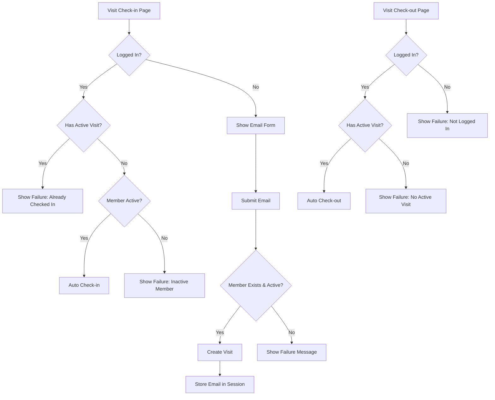

# Mulai Gym Web App

## Check-in/Check-out Flow

### Session
- 1-year duration
- Key: `member_email`
- Persists across check-in/out

### Check-in
1. If logged in:
   - Auto check-in if active member & no active visit
   - Show failure if inactive or has active visit
2. If not logged in:
   - Show email form
   - On submit: validate & create visit if valid

### Check-out
1. If logged in:
   - Auto check-out if has active visit
   - Show failure if no active visit
2. If not logged in:
   - Show failure

### Flow Diagram

### Validations & Messages
- Check-in:
  - Must be active member
  - No duplicate active visits
  - Messages: "Already Checked In", "Membership Expired"
- Check-out:
  - Must be logged in
  - Must have active visit
  - Messages: "Not Logged In", "No Active Visit Found"
