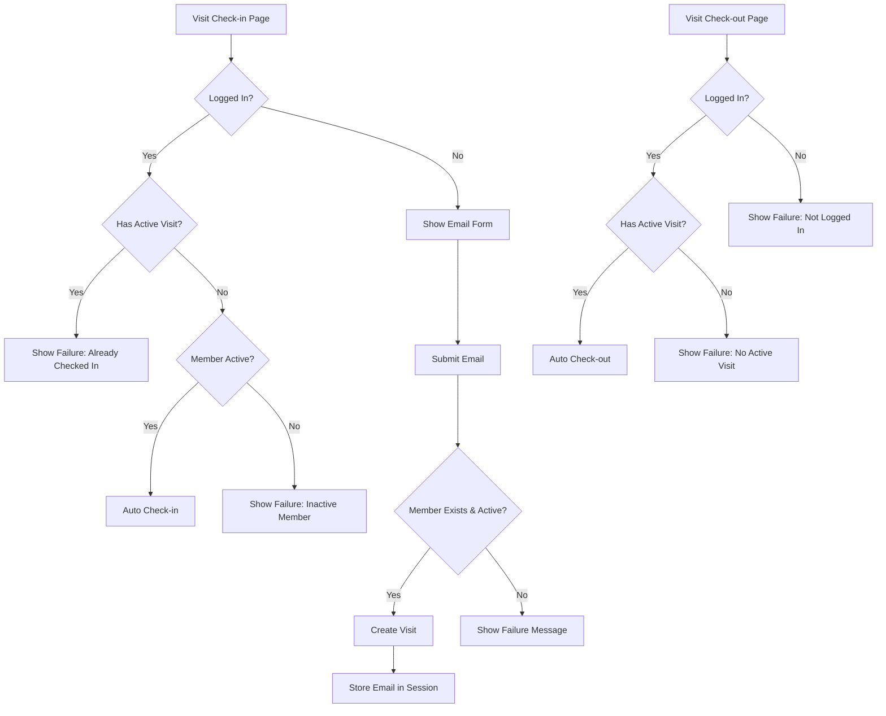

# Mulai Gym Web App

## Visits & Check-in/Out

### Session
- 1-year duration
- Key: `member_email`
- Persists across check-in/out

### Models
- **`Visit` (`visits/models.py`)**
  - `member`: ForeignKey (Member)
  - `check_in_time`: DateTimeField
  - `check_out_time`: DateTimeField (nullable)
- **`Member` (`accounts/models.py`)**
  - `active_until`: DateTimeField (nullable)
  - `is_active_member` property: Checks if `active_until >= today`.

### Admin (`visits/admin_init.py`)
- **`MemberAdmin`**
  - Displays name, email, phone, `active_until`, status.
  - `membership_status` method calculates Active/Expired.
- **`VisitAdmin` (`visits/admin.py`)**
  - Displays member, check-in/out times, duration.
  - Filters, search fields defined.

### Views (`visits/views.py`)
- **`check_in_page`**
  1. Checks session for `member_email`.
  2. If logged in:
     - Tries auto check-in (validates active member, no active visit).
     - Renders success/failure template.
  3. If not logged in or auto-check-in fails:
     - Shows email form (`check_in.html`).
     - On POST: validates member, activity, active visits -> creates `Visit`, sets session, renders success/failure.
- **`check_out_page`**
  1. Checks session for `member_email` (renders fail if not logged in).
  2. Tries auto check-out:
     - Finds latest active `Visit` for member.
     - Sets `check_out_time`, saves `Visit`.
     - Renders success/failure template.
- **`forget_member`**
  - Clears `member_email` from session.

### Check-in/Out Flow Diagram

### Validations & Messages
- Check-in:
  - Must be active member
  - No duplicate active visits
  - Messages: "Already Checked In", "Membership Expired"
- Check-out:
  - Must be logged in
  - Must have active visit
  - Messages: "Not Logged In", "No Active Visit Found"

## Payments

### Model (`Payment`)
- `payment_method`: CharField (TRANSFER, QRIS, CASH), default TRANSFER, blank=True.
- `created_by`: ForeignKey (User), SET_NULL, null=True, blank=True. Automatically set in admin.
- `membership_end_date`: Calculated in `save()`, not editable in forms.

### Admin (`visits/admin_init.py`)
- **`CustomPaymentAdmin`**
  - Uses `PaymentAdminForm`.
  - `fieldsets` exclude `created_by`.
  - `save_model` sets `created_by = request.user`.
  - `payment_method` shown as dropdown.

### Membership Duration Logic (`Payment.save()`)
1.  **Determine Start Date**:
    - If member active (`active_until >= today`): `start_date = member.active_until + 1 day`.
    - If member inactive (`active_until < today` or `None`): `start_date = payment_date` (or today).
2.  **Calculate Payment `membership_end_date`**:
    - Based on `start_date + duration` (using `relativedelta`).
3.  **Update Member `active_until`**:
    - Always set `member.active_until = self.membership_end_date`.
    - Ensures correct stacking/renewal regardless of current status.
